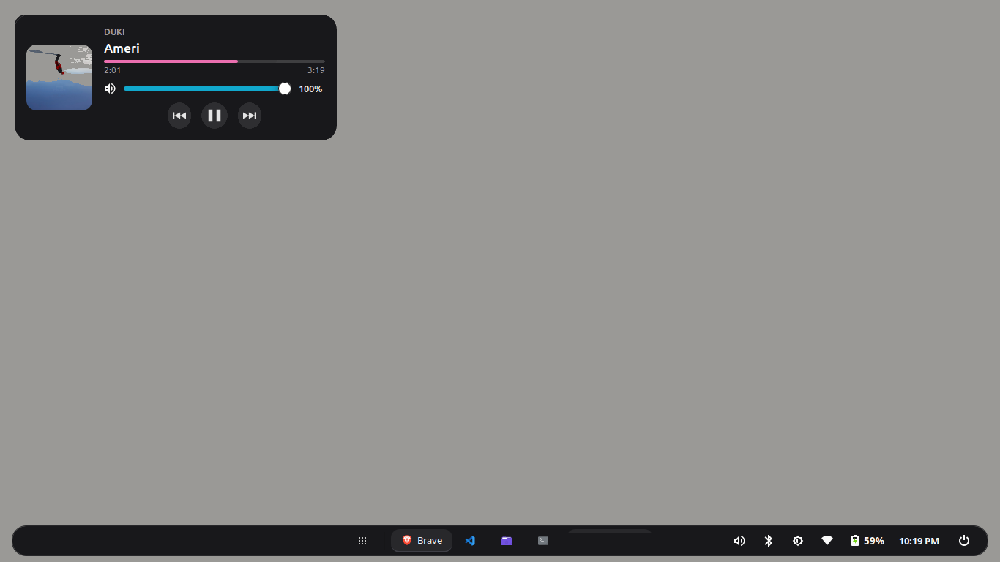

# Quick Panel (Entorno Premium Multi-Plataforma)



Un entorno de escritorio súper ligero, rápido y hermoso para reemplazar paneles tradicionales en **Linux** (Linux Mint, XFCE, Ubuntu) y **Windows** (10/11). Construido completamente en Python y GTK3. Diseñado con una estética moderna de glassmorphism, botones flotantes, esquinas redondeadas, tarjetas interactivas de reproducción y animaciones fluidas.

---

## 🚀 Características y Componentes principales

- 🎛️ **Quick Panel (`quick-panel.py`)**: La barra principal flotante que actúa como Dock inteligente y Panel de control unificado.
- 🎵 **OSD y Reproductor de Música (`quick-osd.py`)**: Tarjeta flotante con esquinas redondeadas en el lado izquierdo. Incluye:
  - Portada del álbum en alta definición.
  - Nombre del artista y canción.
  - **Barra de reproducción interactiva** para buscar y adelantar/atrasar cualquier momento de la canción con timestamps en vivo (`2:01 / 3:19`).
  - Control de volumen (hasta 100%).
  - Botones integrados de pista anterior, pausa/reproducción y siguiente.
- 🔔 **Sistema de Notificaciones (`quick-notifications.py`)**: Centro de notificaciones flotantes con soporte para apps del sistema y reproductores multimedia.
- 📶 **Gestor Wi-Fi Inteligente (`quick-wifi.py`)**: Escaneo de redes inalámbricas y generador automático de código QR gigante en pantalla para compartir la clave con dispositivos móviles.
- 🚀 **Lanzador de Aplicaciones (`quick-launcher.py`)**: Menú flotante con barra de búsqueda y autocierre por pérdida de foco.
- 🔋 **Batería, Brillo, Calendario y Menú de Energía**: Widgets dedicados para monitoreo de energía, brillo instantáneo, calendario y apagado/reinico.

---

## 📦 Instalación automática

### 🐧 En Linux (Linux Mint, XFCE, Ubuntu, Debian):

Abre una terminal y ejecuta:

```bash
git clone https://github.com/NioyDev/quick-panel.git
cd quick-panel
./install.sh
```

> **¿Qué hace el instalador de Linux?**
> - Instala automáticamente todas las dependencias (`python3-gi`, `cairo`, `xdotool`, `pulseaudio-utils`, etc).
> - Deshabilita el panel clásico viejo de XFCE.
> - Copia los archivos del sistema a `~/.local/bin/`.
> - Activa los demonios y servicios `systemd` para arranque automático.

---

### 🪟 En Windows (Windows 10 / 11):

Abre la consola CMD o PowerShell y ejecuta:

```cmd
git clone -b windows https://github.com/NioyDev/quick-panel.git
cd quick-panel
install.bat
```

*(O simplemente haz **doble clic en `install.bat`** dentro de la carpeta del proyecto)*.

> **¿Qué hace el instalador de Windows?**
> - Instala automáticamente las librerías necesarias vía `pip` (`PyGObject`, `pycaw`, `winsdk`, `comtypes`).
> - Configura la ejecución silenciosa sin abrir consolas negras CMD de fondo.
> - Agrega el acceso directo a la carpeta de Inicio de Windows (`Startup`) para autoinicio al encender la PC.

---

## 👤 Autor

Desarrollado y mantenido por **[NioyDev](https://github.com/NioyDev)**.
